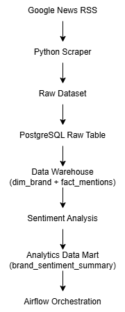
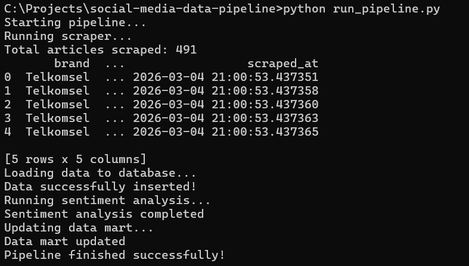
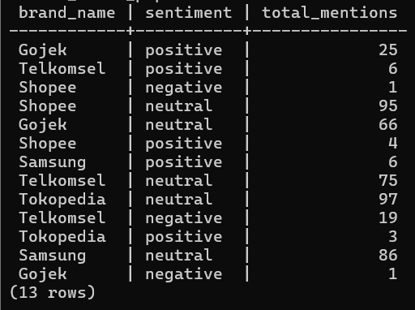

# Social Media Monitoring Data Pipeline

An end-to-end **Data Engineering pipeline** that collects brand mentions from Google News, processes the data, performs sentiment analysis, and generates analytics-ready datasets.

---

## 🚀 Project Overview

This project simulates a **media monitoring / social listening system** similar to platforms used by analytics companies.

The pipeline collects news mentions of multiple brands, processes them through a data pipeline, and stores them in a structured data warehouse for analytics.

---

## 🧠 Architecture



---

## ⚙️ Tech Stack

* Python
* PostgreSQL
* Pandas
* VADER Sentiment Analysis
* Apache Airflow (DAG prepared)

---

## 📊 Pipeline Flow

1. **Scraping**

   * Collect news data from Google News RSS.

2. **Data Ingestion**

   * Load raw data into PostgreSQL.

3. **Data Warehouse**

   * Transform raw data into dimensional model:
   * `dim_brand`
   * `fact_mentions`

4. **Sentiment Analysis**

   * NLP sentiment scoring on news titles.

5. **Data Mart**

   * Aggregated analytics table:
   * `brand_sentiment_summary`

---

## 📈 Example Analytics

### Brand Mention Count

```sql
SELECT b.brand_name, COUNT(*) AS total_mentions
FROM fact_mentions f
JOIN dim_brand b
ON f.brand_id = b.brand_id
GROUP BY b.brand_name
ORDER BY total_mentions DESC;
```

### Sentiment Distribution

```sql
SELECT sentiment, COUNT(*)
FROM fact_mentions
GROUP BY sentiment;
```

---

## 🗂 Project Structure

```
social-media-data-pipeline
│
├── scraper
│   └── google_news_scraper.py
│
├── ingestion
│   ├── load_to_postgres.py
│   ├── sentiment_analysis.py
│   └── update_data_mart.py
│
├── docs
│   └── architecture.png
│
├── run_pipeline.py
├── requirements.txt
└── README.md
```

---

## 🔄 Pipeline Execution

Run the entire pipeline:

```
python run_pipeline.py
```

Pipeline steps:

```
scraper → ingestion → sentiment → data mart
```

---

## Example Output

### Pipeline Execution



### Query Result



## 📌 Future Improvements

* Airflow pipeline orchestration
* Data quality validation
* Dockerized deployment
* Dashboard visualization
